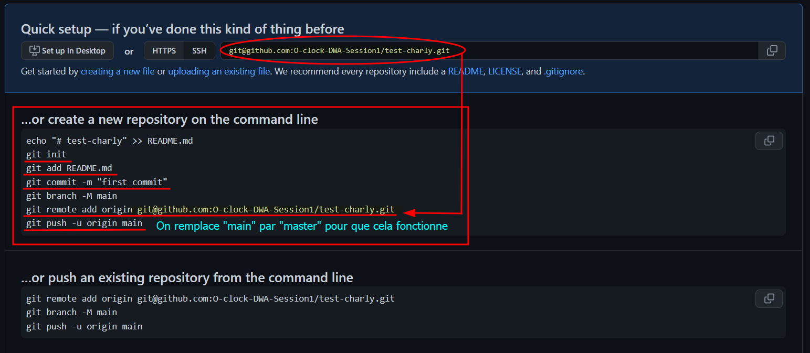

# Instructions de l'atelier 
###### SAISON 1 - EPISODE 14

1. **Préparation d'un dossier** :
    - je crée un nouveau dossier nommé "EP14" dans le dossier **student>DWA Qilin>S01**
  
2. **Clonage d'un dépot** :
    - Dans GitHub, j'accède à la page du dépot, je clique sur l'onglet **Code** puis copie l'URL du dépot pour cloner avec une clé SSH
    - J'ouvre un terminal puis je mets le répertoire cloné "EP14"
    - Je tape la commande `git clone` puis colle l'URL que j'ai copiée précédemment.
3. **Détachement de GitHub d'un projet local du projet distant**
     - Pour supprimer le dossier .git/, je tape la commande `rm -R .git/` puis valide en tapant `Y` ou `yes`
  
4. **Création d'un nouveau dépot sur Github**
     - J'accède à la page des dépots [GitHub.com](https://github.com/O-clock-DWA-Qilin)
     - Je crée un dépot privé sans cocher la case &#x29E0; readme.md que je vais nommer S01E14-atelier-github-*(tonpseudo)*-solution 
  
>###### Exemple
Lignes de commande Terminal
 ```
    git init
    git add README.md
    git commit -m "first commit"
    git remote add origin git@github.com:O-clock-DWA-Session1/(tonpseudo).git 
        (à remplacer par mon lien SSH)
    git push -u origin master
```
1. **Rédaction d'un fichier instructions.md sur VSCode**
     - Je crée le fichier instructions.md sur l'explorateur VSCode ou le crée avec le terminal `touch instructions.md`
     - J'ouvre le fichier **instructions.md** et travailler dessus.
     - Blabla...

2. **Versionning (versionner) en local sur Github** 
     - `git add .` ajouter toutes les modifications
     - `git commit -M "explication"` créer un nouveau commit 
     - `git push` pousser les modifications vers Github